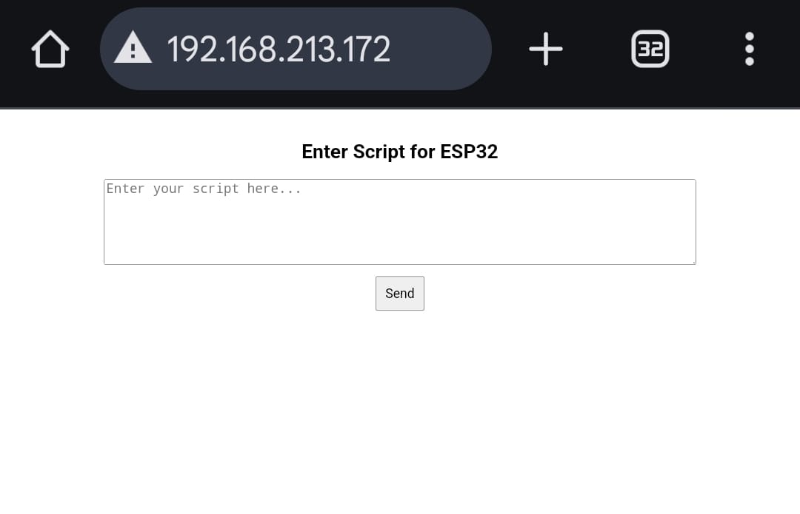

# PROJECT_K

**KEYSROKE INJECTION
MODULE USING ESP32
HID EMULATION DEVICE**

first install aurdino ide software on window 
add libraries which are needed  
#include "Arduino.h" 
#include "USB.h" 
#include "USBHIDKeyboard.h" 
#include <WiFi.h> 
#include <WebServer.h> 

  1. Open Arduino IDE.
  2. Go to `Tools` > `Board` > `Boards Manager`.
  4. Search for "ESP32" and install the package by Espressif Systems.
  5. goto tools in main page of ide.
  6. click on boards
  7. then select esp32 s3 boards.
  8. copy and paste code which is provided on github repo.
  9. change wifi password to your wifi settings.
  10. change payload if needed
  11. Connect the ESP32-S3 Mini to Your Computer**

    - Use a USB cable to connect the ESP32-S3 Mini to your computer.

    - If the device is not recognized, you may need to install the appropriate USB-to-UART bridge drivers. Common drivers include:
  12. Select the Correct Port**

    - In the Arduino IDE, navigate to `Tools` > `Port`, and select the port corresponding to your ESP32-S3 Mini device.
  13. Upload the Sketch**

    - Click the upload button (right-pointing arrow) in the Arduino IDE to compile and upload the sketch to your device.

    **Note**: Some users have reported issues when uploading code to the ESP32-S3 Mini. If you encounter such problems, you might need to manually set the device to bootloader mode:

    - Press and hold the `BOOT` button on the device.

    - While holding the `BOOT` button, press the `RESET` button once.

    - Release the `BOOT` button.

  ## Connecting to Wi-Fi

    -  now plugin the device into pc/laptop. 
    -  you get ip address of the device connnected to wifi in serial monitor. copy the ip address from it and paste on the         broswer search bar.
    -  then press enter.
    -  then a local webpage will open on broswer. webpage will look like the image shown below
   

     Connecting to Wi-Fi 
    - now paste your script to execte on powershell window 
  

    

